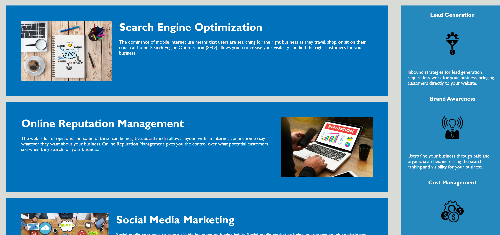

# 02-Homework - Horiseon Landing Page Refactoring
##Repository for Homework 2 - Horiseon Site

The Horiseon landing page needs to look clean, be accessible, and be functional. The page is set up into 5 sections: Navigation header, Hero banner, Benefits section, Benefits aside, and Footer.
The sections are set up such that the user can arrive on the page, quickly find and use any navigation as needed at the top, or scroll down to find the information logically laid out. 
Sections are appropriately labeled with semantic tags in the HTML and alt text is provided for any images that would otherwise provide the text on screen. 

https://alexjalva.github.io/Horiseon-Landing-Page-Refactoring/

##Installation

All files needed are contained within the repository. The main folder needs to include the assets folder and the index.html file. As long as all files are included, and placed in that order, the html should be able to find the images based on relative path. 

##Usage

Webpage can be loaded based off of html in main repository. 

The header is displayed with a list of 3 header elements. Clicking on any of the 3 will move the user to that section further down on the page. 
```md

```
The information and benefits are displayed as in the screenshot. Each of those h2s corresponds to one of the clicks from the header above. Other benefits information is displayed in the aside. 
```md

```

##Credits
Original page was created by Trilogy education.
https://ucsd.bootcampcontent.com/UCSD-Coding-Bootcamp

##License
MIT License

Copyright (c) 202 Alexander Alvarado 

Permission is hereby granted, free of charge, to any person obtaining a copy
of this software and associated documentation files (the "Software"), to deal
in the Software without restriction, including without limitation the rights
to use, copy, modify, merge, publish, distribute, sublicense, and/or sell
copies of the Software, and to permit persons to whom the Software is
furnished to do so, subject to the following conditions:

The above copyright notice and this permission notice shall be included in all
copies or substantial portions of the Software.

THE SOFTWARE IS PROVIDED "AS IS", WITHOUT WARRANTY OF ANY KIND, EXPRESS OR
IMPLIED, INCLUDING BUT NOT LIMITED TO THE WARRANTIES OF MERCHANTABILITY,
FITNESS FOR A PARTICULAR PURPOSE AND NONINFRINGEMENT. IN NO EVENT SHALL THE
AUTHORS OR COPYRIGHT HOLDERS BE LIABLE FOR ANY CLAIM, DAMAGES OR OTHER
LIABILITY, WHETHER IN AN ACTION OF CONTRACT, TORT OR OTHERWISE, ARISING FROM,
OUT OF OR IN CONNECTION WITH THE SOFTWARE OR THE USE OR OTHER DEALINGS IN THE
SOFTWARE.